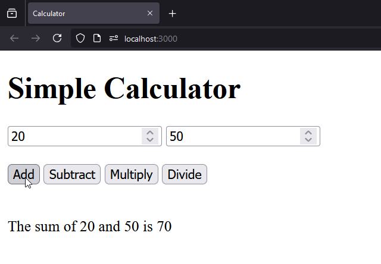

# Simple Calculator Web Application



A basic web application using Node.js and Express to perform arithmetic operations. Users can add, subtract, multiply, and divide numbers via a web interface.

## Endpoints

- **GET /add**: Adds two numbers. Query parameters: `num1`, `num2`.
- **GET /subtract**: Subtracts the second number from the first. Query parameters: `num1`, `num2`.
- **GET /multiply**: Multiplies two numbers. Query parameters: `num1`, `num2`.
- **GET /divide**: Divides the first number by the second. Handles division by zero. Query parameters: `num1`, `num2`.

## Installation Instructions

1. **Install Dependencies**
   Ensure you have Node.js installed. Run:

   ```bash
   npm install
   ```

2. **Run the Server**
   Start the server with:

   ```bash
   node server.js
   ```

3. **Access the Application**
   Open your browser and navigate to `http://localhost:3000`.
